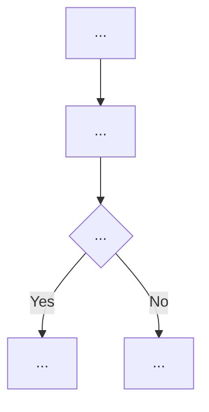

Review算法，每次先检查是否有明显bug，有的话直接汇报，我会手动再另一个session里解决。无论是否有bug，都汇总一个算法流程图，作为输出，使得我可以明显的看出算法流程，看看有没有问题。

## Arguments

$ARGUMENTS - 要 review 的文件路径或模块名。例如:
  - "RL/mc_finetune.py"
  - "RL/ppo_finetune.py"
  - "mc_finetune" （自动补全为 RL/mc_finetune.py）
  - 留空则 review 当前 IDE 中打开的文件

## Instructions

### Step 0: 确定目标文件

- 如果 $ARGUMENTS 提供了文件路径，使用该路径
- 如果只提供了模块名（如 "mc_finetune"），自动查找 `RL/{name}.py`
- 如果 $ARGUMENTS 为空，检查对话上下文中是否有 IDE 打开的文件（ide_selection / ide_opened_file），使用该文件
- 如果以上都没有，提示用户指定文件

读取目标文件的完整内容。如果文件 import 了关键的自定义模块（如 `from data.data_collection.ppo import Agent`），也读取被引用的模块以理解完整逻辑。

### Step 0.5: 提取用户算法意图（Intent Extraction）

从对话上下文中提取用户对该算法的描述和期望，作为 ground truth 来对照代码实现。

**搜索范围**（按优先级）：
1. 用户在当前对话中对算法的自然语言描述（如 "用 Q-V 来估计 advantage"、"MC 分别估计 Q 和 V"）
2. 用户纠正过的设计决策（如 "不是直接用 MC return，是用 Q-V"）
3. 代码文件的 docstring 和注释

**提取内容**：
- **Advantage 计算方式**: 用户期望 advantage 怎么算？（如 Q-V, GAE, raw MC return）
- **价值估计来源**: 用的是什么 policy？（当前 policy / optimal policy / learned critic）
- **训练目标**: 训练哪些参数？（actor only / actor+critic）
- **关键约束**: 用户强调的任何限制（如 "不学 critic"、"必须用 optimal policy"）

输出格式（内部使用，不直接展示给用户，但会在 Step 1 中用于对照）：
```
[用户意图摘要]
- Advantage: Q^π*(s,a) - V^π*(s)
- Q估计: MC re-rollout, take a_t then follow π*
- V估计: MC re-rollout, sample from π* then follow π*
- 训练: actor only
```

**如果对话中没有足够的算法描述**（如直接运行 /review-algo 没有上下文），跳过此步骤，仅依赖代码自身的 docstring。

### Step 1: Bug 检查

逐行审查代码，重点关注以下类别的 bug：

**1.1 张量维度 / shape 错误**
- broadcast 是否正确（特别是 reward、done、advantage 的 shape）
- `.view(-1)` 或 `.reshape()` 是否合理
- 矩阵乘法维度是否匹配

**1.2 梯度相关**
- 该 detach 的地方有没有 detach（如 target network、advantage 计算）
- `torch.no_grad()` 是否正确包裹了不需要梯度的计算
- 是否漏了 `optimizer.zero_grad()`
- frozen 参数是否真的不参与训练

**1.3 RL 算法逻辑**
- advantage 计算公式是否正确（对照文档注释描述的算法）
- **意图对照**（如果 Step 0.5 提取了用户意图）：代码实现是否与用户描述的算法一致？特别关注：
  - advantage 的来源和计算方式是否匹配用户描述
  - 使用的 policy（当前 / optimal / learned）是否正确
  - 训练的参数范围是否正确
- reward discount 是否正确处理了 episode boundary（done flag）
- PPO clip 方向是否正确（max vs min）
- 损失函数符号是否正确（最大化还是最小化）
- GAE / TD / MC return 的计算是否与注释描述一致

**1.4 环境交互**
- state save/restore 逻辑是否完整（存了就得恢复）
- action clipping 是否一致
- obs/reward 是否用到了正确的变量（防止 off-by-one）
- episode 结束处理是否正确

**1.5 数据流错误**
- 训练数据是否正确打乱和分 batch
- buffer 索引是否越界
- on-policy 数据是否被正确使用（不能用旧 rollout 的 obs 配新 rollout 的 action）

**1.6 常见陷阱**
- inplace 操作是否影响了梯度
- 类型错误（float vs long vs bool）
- seed 相关问题（是否意外覆盖了环境随机性）

### Step 2: Bug 报告 （如有 bug）

如果发现了 bug，输出报告。格式如下：

```
# 🐛 Bug Report: [文件名]

## Bug 1: [简要标题]
**位置**: 第 XX 行
**严重性**: 🔴 高 / 🟡 中 / 🟢 低
**描述**: 具体说明问题是什么
**代码**:
```python
# 当前代码（有问题）
...
```
**建议修复**:
```python
# 修复后应该是
...
```
**影响**: 这个 bug 会导致什么后果

## Bug 2: ...
（如果有更多 bug）

---
💡 请在另一个 session 中修复以上 bug，修复后再次运行 /review-algo 检查。
```

如果没有发现 bug，输出 `✅ 未发现 bug。`

**无论是否有 bug，都继续执行 Step 3。** 流程图是必须输出的，用户需要通过流程图来人工验证算法设计是否符合预期。

### Step 3: 算法流程图 （始终执行）

生成算法流程图。

**3.1 用 Mermaid 格式** 输出流程图（可在 Markdown 中直接渲染）：



流程图应包含：
- **初始化阶段**: 模型加载、环境创建、优化器配置
- **主循环结构**: iteration 层级的流程
- **数据收集**: rollout 过程，包括与环境的交互
- **关键计算**: advantage/return 计算的具体方式（这是区分不同算法的核心）
- **策略更新**: loss 计算和梯度更新的逻辑
- **评估**: eval 的触发条件和流程
- 用 **粗体** 标注算法的核心/独特步骤
- 在关键节点用注释标明 **数学公式**（如 `A = Q(s,a) - V(s)`）

**3.2 关键公式总结**

在流程图下方，列出算法用到的所有关键公式：

```
## 核心公式

1. **Advantage**: A(s,a) = Q^π*(s,a) - V^π*(s)
2. **MC Return**: G_t = Σ γ^k r_{t+k}
3. **PPO Loss**: L = max(-A·r(θ), -A·clip(r(θ), 1±ε))
...
```

**3.3 算法特征摘要**

用一个简洁的表格总结算法的关键特征：

```
## 算法特征

| 特征 | 本算法 |
|------|--------|
| Value estimation | MC re-rollout with π* |
| Advantage type | Q^π* - V^π* |
| Baseline | V^π* (MC sampled) |
| Policy update | PPO clip |
| On/Off-policy | On-policy collection, off-policy evaluation |
| Critic training | None (actor only) |
```

## Rules

- 语言: 跟随对话的主要语言
- Bug 检查必须严谨：只报告**确定是 bug** 的问题，不确定的、风格性的、可改进但不是 bug 的问题**不要报告**
- 如果发现 bug，**不要尝试修复**，只报告。用户会在另一个 session 中处理
- 流程图要足够详细，能区分不同算法的差异（如 PPO vs MC vs IQL）
- 流程图中的节点文字要简洁，详细说明放在公式总结中
- 每次 review 只针对一个文件
- 如果代码中有明显的 TODO 或 FIXME 注释，也在报告末尾提及
